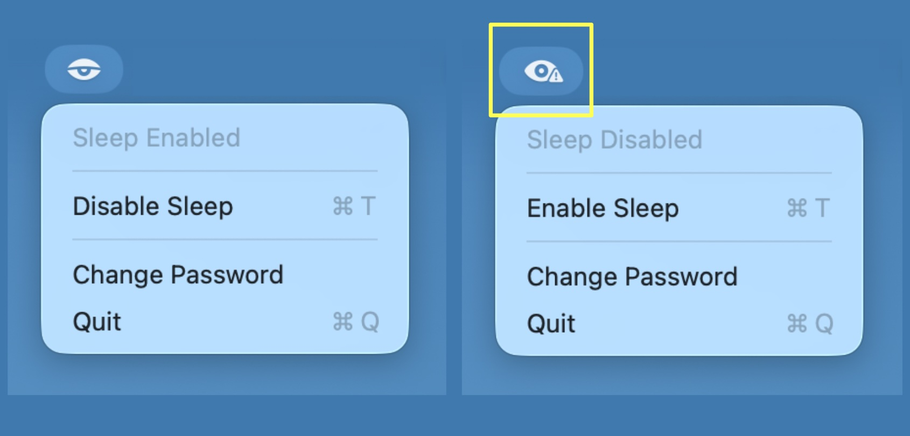

<div align="center">



# SteamPack

**클릭 한 번으로 Mac의 잠자기를 방지합니다.**

[](LICENSE)
[](https://www.apple.com/macos/)
[](https://swift.org)
[](scripts/build.sh)

*토글 · 저장 · 잊기 — 메뉴바에서 잠자기 제어.*

[시작하기](#-시작하기) · [동작 원리](#-동작-원리) · [사용법](#-사용법) · [빌드](#-소스에서-빌드) · [아키텍처](#-아키텍처)

</div>

---

## 이게 뭔가요?

SteamPack은 Mac의 잠자기 모드를 클릭 한 번으로 토글하는 **경량 macOS 메뉴바 유틸리티**입니다. 내부적으로 `pmset -a disablesleep` 명령어를 실행합니다. 더 이상 터미널에서 긴 명령어를 입력할 필요가 없습니다.

> **왜 "SteamPack"?** — 증기 제트팩처럼 계속 날게 해주듯, SteamPack은 Mac이 잠들지 않고 계속 달리게 합니다.

---

## ✨ 주요 기능

- **원클릭 토글** — 메뉴바에서 잠자기 모드 켜고 끄기
- **안전한 비밀번호 저장** — sudo 비밀번호를 macOS Keychain에 저장
- **제로 풋프린트** — 도크 아이콘 없음, 창 없음, 메뉴바 아이콘만
- **Universal Binary** — Apple Silicon과 Intel 네이티브 지원
- **의존성 없음** — 순수 AppKit, 서드파티 라이브러리 불필요

---

## 🚀 시작하기

### DMG 다운로드

1. [Releases](../../releases)에서 `SteamPack.dmg` 다운로드
2. DMG 열기 → **SteamPack**을 **Applications**로 드래그
3. SteamPack 실행

### 소스에서 빌드

```bash
git clone https://github.com/tykimos/steampack.git
cd steampack
bash scripts/build.sh
open build/SteamPack.app
```

> **요구사항:** Xcode Command Line Tools (`xcode-select --install`)

---

## 👁 사용법

| 단계 | 동작 |
|------|------|
| **실행** | 메뉴바에 눈 모양 아이콘 표시 |
| **첫 실행** | sudo 비밀번호 입력 (Keychain에 저장) |
| **토글** | 아이콘 클릭 → **Disable Sleep** / **Enable Sleep** |
| **비밀번호 변경** | 아이콘 클릭 → **Change Password** |
| **종료** | 아이콘 클릭 → **Quit** (`⌘Q`) |

### 메뉴바 아이콘

| 아이콘 | 상태 | 의미 |
|--------|------|------|
| `eye.half.closed.fill` | 일반 | 잠자기 **허용** — Mac이 정상적으로 잠들 수 있음 |
| `eye.trianglebadge.exclamationmark.fill` | 활성 | 잠자기 **차단** — Mac이 깨어 있음 |

---

## ⚙️ 동작 원리

SteamPack은 macOS Keychain에 저장된 비밀번호로 `sudo pmset -a disablesleep 1` (차단) 또는 `0` (허용) 명령어를 실행합니다.

```
┌─────────────────────────────────────────────────────┐
│                  macOS 메뉴바                        │
│                                                     │
│   ┌───┐  클릭                                       │
│   │ 👁 │ ──────→ ┌──────────────────┐               │
│   └───┘          │ Sleep Enabled    │  ← 상태       │
│                  │──────────────────│               │
│                  │ Disable Sleep ⌘T │  ← 토글       │
│                  │──────────────────│               │
│                  │ Change Password  │               │
│                  │ Quit          ⌘Q │               │
│                  └──────────────────┘               │
│                         │                           │
│                         ▼                           │
│              ┌────────────────────┐                 │
│              │  macOS Keychain    │                 │
│              │  (sudo 비밀번호)    │                 │
│              └────────┬───────────┘                 │
│                       ▼                             │
│         echo $PW | sudo -S pmset                    │
│              -a disablesleep 1/0                    │
└─────────────────────────────────────────────────────┘
```

---

## 🏗 아키텍처

```
steampack/
├── src/
│   ├── AppMain.swift          # 앱 진입점, NSStatusItem 메뉴바
│   ├── SleepToggle.swift      # pmset 실행 및 상태 감지
│   ├── KeychainHelper.swift   # Keychain Services 래퍼
│   └── PasswordPrompt.swift   # 비밀번호 입력 다이얼로그
├── scripts/
│   ├── build.sh               # 빌드 자동화 (swiftc)
│   └── create-dmg.sh          # DMG 패키징 (hdiutil)
├── AppInfo.plist              # 앱 번들 설정
├── capture.jpg                # 스크린샷
├── README.md                  # English
└── README_ko.md               # 한국어
```

---

## 🔒 보안

- 비밀번호는 **macOS Keychain**에만 저장 (`com.steampack.sudo`)
- 비밀번호는 **stdin 파이프**로 sudo에 전달 — 프로세스 목록에 노출 안됨
- 인증 실패 시 비밀번호 재입력 요청
- Ad-hoc 코드 서명

---

## 📄 라이선스

MIT License — 자세한 내용은 [LICENSE](LICENSE)를 참조하세요.

<div align="center">

*Built with ❤️ and [Claude Code](https://claude.ai/code)*

</div>
